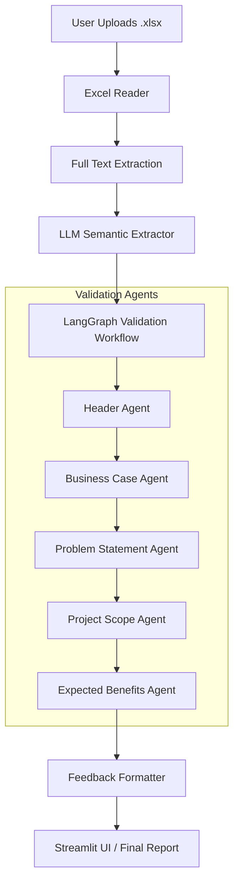
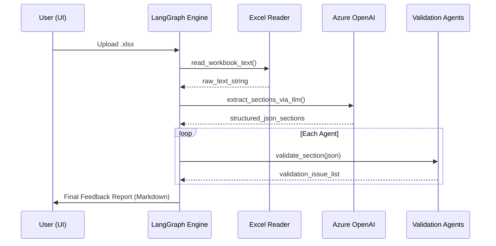
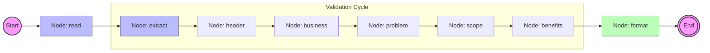

# Project Intake Validator: Technical Documentation

## 1. High-Level System Overview
The **Project Intake Validator (PIV)** is a specialized tool designed to automate the validation of project intake documents (Excel format). It ensures that all required fields—such as project headers, business cases, problem statements, and scope definitions—are not only present but also meet specific quality and technical standards.

### Problem Solved
Manual review of project intake forms is time-consuming, subjective, and prone to inconsistency. PIV solves this by:
*   **Standardizing Validation**: Applying uniform rules across all submissions.
*   **Speeding Up Feedback**: Providing instantaneous initial validation.
*   **Enhancing Quality**: Using AI (Azure OpenAI) to analyze the semantic quality of technical justifications and business cases.

### Design Decisions & Trade-offs
*   **LangGraph for Orchestration**: Chosen for its ability to model complex, stateful workflows. Although currently linear, the graph structure allows for future conditional loops (e.g., if a section fails, re-extract or ask for clarification).
*   **Stateless Agents**: Individual validation logic is encapsulated in stateless functions/agents, making the system highly modular and easy to test.
*   **Dual Extraction/Validation**: The system first extracts semantic sections via LLM and then validates them using a mix of rule-based logic and AI heuristics. This separation reduces LLM costs and improves reliability.

---

## 2. System Architecture
The system follows a **Modular Graph-based Architecture** powered by LangGraph.

### Architecture Diagram (Mermaid)


### Components Interaction
1.  **Input Layer**: Streamlit UI handles file uploads and passes the file path to the graph.
2.  **Preprocessing**: `ExcelReader` converts workbook content into a single searchable string. `SemanticExtractor` uses Azure OpenAI to segment the text into logical parts (Header, Scope, etc.).
3.  **State Management**: A central `dict` (LangGraph state) holds the document text, extracted sections, and accumulated validation results.
4.  **Logic Layer**: Sequential nodes in the graph invoke specialized agents. Each agent appends its findings to the state.
5.  **Output Layer**: The `Report` module synthesizes all validation issues into a human-readable summary.

---

## 3. Detailed Component Breakdown

### 3.1 Excel Reader (`src/piv/io/excel_reader.py`)
*   **Purpose**: Extract all text from multi-sheet Excel workbooks while preserving layout hints.
*   **Inputs**: Absolute path to an `.xlsx` file.
*   **Output**: A single string containing all rows and sheets.
*   **Internal Logic**: Iterates through sheets and rows using `openpyxl`. It also handles Hyperlinks by appending the target URL to the cell text (critical for ticket validation).

### 3.2 Semantic Extractor (`src/piv/preprocessing/semantic_extractor.py`)
*   **Purpose**: Divide the messy raw text of an Excel sheet into structured JSON sections.
*   **Dependencies**: Azure OpenAI (through `AzureOpenAILLM`).
*   **Logic**: Uses a specific prompt (`section_extractor.md`) to guide the LLM in identifying where one section ends and another begins based on semantic context.

### 3.3 Validation Agents (`src/piv/agents/`)
*   **Header Agent**: Validates mandatory fields (Practice, Project Name), date formats, and clickable hyperlinks.
*   **Business Case Agent**: Uses keyword analysis and length heuristics to ensure technical depth and alignment with "Softtek Big Y" and KPIs.
*   **Problem Statement Agent**: Checks for clarity and completeness (Current Pain Points, Impacts).
*   **Scope Agent**: Verifies that "In Scope" and "Out of Scope" definitions are substantial.
*   **Expected Benefits Agent**: Validates both Qualitative descriptions and Quantitative values (Hard/Soft Dollars for both Softtek and Client).

---

## 4. Data Flow Explanation
1.  **Entry**: User clicks "Run Validation" in Streamlit.
2.  **State Initialization**: A state dictionary is created with the `source_path`.
3.  **Read Node**: `openpyxl` loads the file; text is saved to `state["document_text"]`.
4.  **Extract Node**: LLM processes the text; `state["sections"]` is populated with JSON.
5.  **Agent Nodes**: Each agent (Header -> Business -> Problem -> Scope -> Benefits) reads its relevant section and updates `state["validation"]`.
6.  **Format Node**: `format_feedback` generates the final Markdown report.
7.  **Exit**: Streamlit displays the `final_feedback` and technical JSON details.

---

## 5. Technology Stack
*   **Python 3.10+**: Core programming language.
*   **LangGraph**: Workflow orchestration and state management.
*   **Azure OpenAI**: Powering semantic extraction and complex qualitative validation.
*   **Streamlit**: Fast, interactive web frontend for document interaction.
*   **OpenPyXL**: Specialized Excel parsing with support for data-only modes and hyperlinks.
*   **Pydantic**: Data modeling for validation results (via `ValidationResult` and `ValidationIssue` models).
*   **Python-dotenv**: Environment configuration.

---

## 6. Detailed Build-from-Scratch Guide

Follow these steps to replicate the Project Intake Validator from an empty directory.

### Phase 1: Environment & Orchestration
1.  **Repository Setup**:
    Initialize a clean Python environment (3.10+) and install core dependencies: `langgraph`, `langchain-openai`, `streamlit`, `openpyxl`.
2.  **State Definition**:
    Create `src/piv/graph/graph.py`. Define the "State" of your system—a dictionary that lists everything the workflow needs to remember (e.g., raw text, parsed JSON sections, and validation flags).
3.  **Graph Construction**:
    In the same file, use `StateGraph(dict)` to define your workflow nodes: `read`, `extract`, `validate_header`, etc. Connect them with `.add_edge()` to define the sequence.

### Phase 2: Data Handling & AI Core
4.  **Excel Parser**:
    Build `src/piv/io/excel_reader.py`. Use `openpyxl` to traverse every sheet. 
    > [!TIP]
    > Append hyperlink targets to cell values so the AI can "see" where the links actually point.
5.  **LLM Integration**:
    Create `src/piv/llm/azure_openai_client.py`. This is your bridge to Azure. Implement a logic that sends a prompt and returns valid JSON.
6.  **Semantic Chunking**:
    Implement `src/piv/preprocessing/semantic_extractor.py`. Feed the raw Excel text to the LLM with a prompt that says "Find the Header, find the Scope, and return them as JSON keys."

### Phase 3: Validation Intelligence
7.  **Agent Logic**:
    Create individual files in `src/piv/agents/`. 
    *   **Header Agent**: Checks for dates and URLs.
    *   **Business Agent**: Scans for keywords like "ROI", "Automation", and "KPI".
    *   **Scope Agent**: Ensures the text is long enough to be meaningful.
8.  **Report Formatting**:
    Create `src/piv/report.py`. This module takes the multi-agent results and formats them into the "✅/❌" check-list style preferred by reviewers.

### Phase 4: User Interface
9.  **Streamlit App**:
    Create `streamlit_app.py`. Use `st.file_uploader` for the Excel file. When the user clicks "Run", call `graph.invoke(initial_state)` and display the results using `st.json` and `st.code`.

---

## 7. Complete Project Structure

```text
project-intake-validator/
│
├── .env                    # Azure OpenAI Credentials
├── .gitignore              # Ignore .venv, __pycache__, and secrets
├── requirements.txt        # Project dependencies
├── streamlit_app.py        # Main Entry Point (UI)
├── main.py                 # CLI Entry Point (Alternative)
│
├── src/
│   └── piv/
│       ├── __init__.py
│       │
│       ├── agents/         # Modular Validation Logic
│       │   ├── __init__.py
│       │   ├── base.py              # Base models (Pydantic)
│       │   ├── header_agent.py      # Basic metadata check
│       │   ├── business_case_agent.py # Strategic alignment
│       │   ├── problem_agent.py     # Pain point analysis
│       │   ├── scope_agent.py       # Boundary definition
│       │   └── expected_benefits_agent.py # ROI check
│       │
│       ├── graph/          # Workflow Orchestration
│       │   ├── __init__.py
│       │   └── graph.py             # LangGraph State & Flow
│       │
│       ├── io/             # Document Processing
│       │   ├── __init__.py
│       │   └── excel_reader.py      # openpyxl logic
│       │
│       ├── llm/            # AI Communication
│       │   ├── __init__.py
│       │   ├── azure_openai_client.py
│       │   └── prompts.py           # Prompt loading helpers
│       │
│       ├── preprocessing/  # Text Cleaning
│       │   ├── __init__.py
│       │   └── semantic_extractor.py # Semantic segmenting
│       │
│       └── report.py       # Final Output Synthesis
│
├── prompts/                # Prompt Engineering
│   └── section_extractor.md # Instructions for the LLM
│
└── tests/                  # Verification
    ├── generate_sample.py  # Create dummy Excel data
    └── run_test_pipeline.py # Integration test
```

---

## 8. System Design Execution (Technical View)



---

## 9. Professional Assumptions
1.  **Format Consistency**: It is assumed that while content varies, the core sections (Header, Scope, etc.) are semantically identifiable by an LLM.
2.  **Network Connectivity**: The system assumes reliable access to Azure OpenAI services.
3.  **Excel Versions**: The system is optimized for `.xlsx` formats (OpenXML).

---

## 9. Graph Workflow Logic (Internal Flow)

This diagram illustrates the exact internal state-machine logic implemented via LangGraph. Each step represents a "Node" in the graph that transforms the shared `state` object.



---
*Documentation generated by Antigravity Technical Specialist.*
