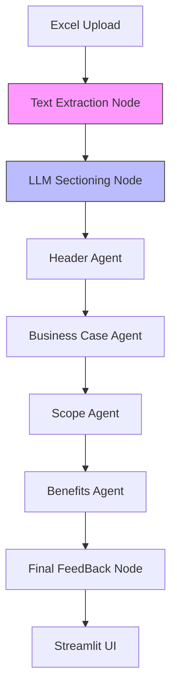

# Your Personal Implementation Guide: Building the Project Intake Validator

Hello! I'm your Technical Mentor for this project. If you're reading this, you've been tasked with building an AI-powered document validation system from total scratch. 

Forget about searching for other documents. **This is the only guide you need.** I’m going to walk you through every decision, every folder, and every line of critical logic as if I'm sitting right next to you.

---

## 🗺️ The Big Picture
Before we touch a terminal, let's understand what we're building. We have messy Excel intake forms. We need to turn them into structured, validated reports. 

### Our Design Philosophy
We aren't building a simple script; we're building a **state-machine**. We'll use **LangGraph** to manage the flow. This means the document moves through "Nodes" (Read -> Extract -> Validate -> Format).

---

## Phase 1: The Foundation (Zero to Hello World)

### 1. Starting Point
Right now, you have an empty folder. The first thing a senior developer does isn't writing code—it's establishing the **safe zone** (the environment).

**Step 1: Initialize your workspace**
```bash
mkdir project-intake-validator && cd project-intake-validator
python -m venv .venv
source .venv/bin/activate  # On Windows: .venv\Scripts\activate
```

**Step 2: Install your "Heavy Lifters"**
We'll use `openpyxl` for Excel, `langgraph` for logic, and `streamlit` for the UI.
```bash
pip install langgraph langchain-openai streamlit openpyxl python-dotenv pydantic
```

**Step 3: Secure your Secrets**
Create a `.env` file. You'll need Azure OpenAI credentials. This is the first file you "configure," because without AI, the extraction fails.

---

## Phase 2: Building the Skeleton (Folder Structure)

Don't create folders just because they look professional. Create them because they have **purpose**. Create this structure now:

```text
/src/piv/
  ├── io/             # Node 1: Where we "breathe in" the data.
  ├── llm/            # The Voice: How we talk to Azure OpenAI.
  ├── preprocessing/  # The Cleaner: How we turn raw text into logical JSON sections.
  ├── agents/         # The Brains: Each agent validates one specific thing.
  └── graph/          # The Glue: Where we define the "LangGraph" flow.
```

---

## Phase 3: Writing your First Logic (The IO Layer)

**What's first?** `src/piv/io/excel_reader.py`.
**Why?** You can't validate a ghost. You need text.
**The Mentor's Tip**: Excel files have multiple sheets. Don't just read the first one. Loop through all of them and flatten everything into one big string. If there are hyperlinks (like Jira tickets), make sure to extract the *target URL*, not just the display text!

---

## Phase 4: Talking to AI (The Semantic Layer)

Now you have a giant string of Excel text. It's too messy for code to understand. We need **Semantic Extraction**.

1.  **Create the Client**: Build a wrapper for Azure OpenAI in `src/piv/llm/`.
2.  **The Prompt**: Create `prompts/section_extractor.md`. Tell the AI: *"Here is raw text. Find the Header, the Business Case, and the Scope. Return them as JSON."*
3.  **The Preprocessor**: Create `src/piv/preprocessing/semantic_extractor.py`. This calls your AI client using that prompt.

**Verification Step**: At this point, run a small test script. Can you turn an Excel file into a JSON object? If yes, keep moving!

---

## Phase 5: The Validation Agents (The Business Rules)

Inside `src/piv/agents/`, you create specialists.
*   **Junior**: "Did they provide a date?" (`header_agent.py`)
*   **Senior**: "Does the business case mention 'ROI' or 'Cost'?" (`business_case_agent.py`)
*   **Architect**: "Is the scope detailed enough?" (`scope_agent.py`)

**Why this way?** If the rules for the Business Case change tomorrow, you only touch *one file*.

---

## Phase 6: Wiring it Together (The LangGraph)

This is the most satisfying part. Open `src/piv/graph/graph.py`.

You are going to define a `StateGraph`. This is a map:
1.  **Node: read** -> calls your Excel reader.
2.  **Node: extract** -> calls your AI extractor.
3.  **Nodes: validate_xxx** -> calls each agent in sequence.
4.  **Node: format** -> turns the validation flags into a pretty report.

**The Design Image (System Architecture)**:


---

## Phase 7: The Final Polish (The UI)

Finally, create `streamlit_app.py`. 
*   Add an `st.file_uploader`.
*   When a file is uploaded, trigger the Graph: `graph.invoke({"source_path": temp_path})`.
*   Show the user the **feedback summary** immediately, then let them expand the **Technical JSON** if they are curious.

---

## 🏁 How you know you are "Done"

You are done when you can run:
```bash
streamlit run streamlit_app.py
```
...upload a completely blank Excel file, and see the system correctly bark back with: **"OVERALL STATUS: NEEDS REVISION"** with specific red icons for missing dates and missing business cases.

**You've got this. Start with the folder structure and let's get building!**
